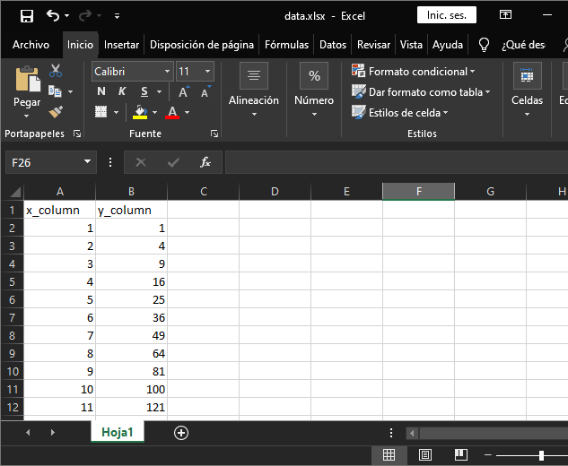
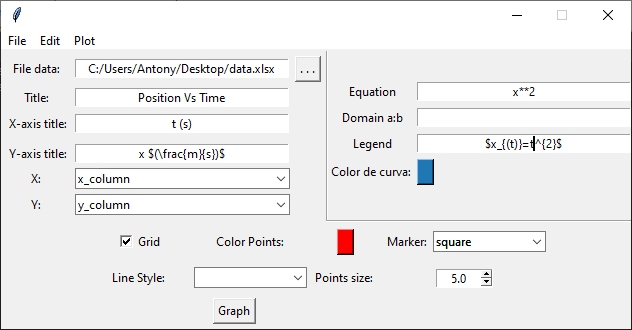
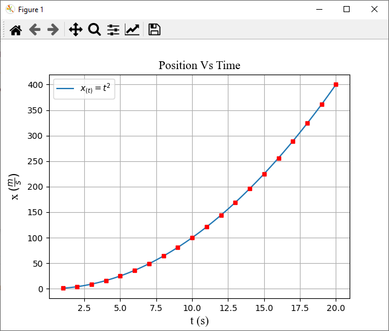

Graphical interface with tkinter to visualize data with matplotlib

This is a simple graphical interface using Python for data visualization with tkinter and matplotlib.
To install the dependencies run:
`pip install -r requirements.txt`

This program is very easy to use, import your data file and edit the characteristics of your graph.

####Select the columns to plot:

